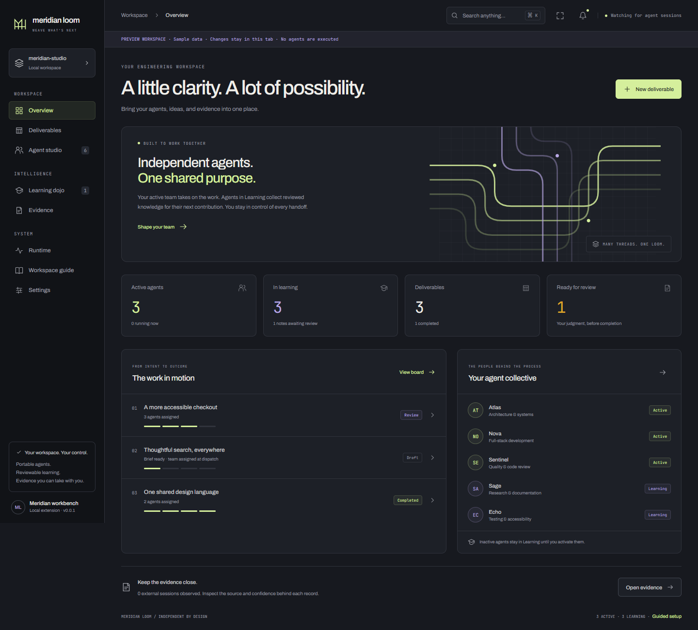

# Meridian workbench — implementation and validation

Updated 8 September 2026. This report covers the GUI continuation requested by the
owner; the concurrently evolving Governor backend remains separately tracked in
`BUILD_STATE.md`. The older percentages in `status.md` are the 7 September audit,
not a recalculation of the current project.

## What is implemented

The sample HTML has been translated into a responsive React workbench with a
quieter charcoal palette, lime and lilac accents, locally bundled fonts, an
original SVG thread illustration, seven themes, and three density settings.
The desktop sidebar becomes a navigation drawer on narrow panels. Theme, density,
view, and focus mode survive panel restoration. Command search, keyboard dialogs,
activity history, loading/error states, and a searchable capability guide connect
the main flows.

| Flow | Implemented behavior | Evidence |
|---|---|---|
| Agent management | Add, update, inspect, remove; validate IDs, executable arguments, instructions and declared permissions | `AgentStudio.tsx`, host validation, browser and component tests |
| Participation | New/imported profiles start in Learning; activate/deactivate without launching; deactivation stops owned runs | `service.ts`, lifecycle tests |
| Independent execution | Each active profile can run a task directly, using its own installed ACP executable; no other agent is required | Real stdio subprocess integration test |
| Portability | Export/import versioned JSON profiles and reviewed memory; imported memory returns to pending review | Host portability tests; native save dialog |
| Delivery work | Create/edit briefs, preview active roster, explicit dispatch, sequential runs, streamed results, stop, human review and completion | Delivery and host queue tests |
| Inactive learning | Learning status, waiting/review state, feedback-derived memory, explicit accept/dismiss, accepted context on next task | Learning UI and runtime tests |
| Evidence | Existing real recorder, external session attribution, confidence/source labels, audit ledger, verification and signed export | Existing evidence assertions retained in the new navigation |
| Runtime | Live health, execution readiness, doctor diagnostics, native configuration entry point | Typed sidecar RPCs and capability state |
| Workspace UX | Overview, search, themes, density, focus mode, mobile navigation, keyboard focus and explicit guided setup | Browser interactions and accessibility scans |

Profiles are stored atomically in `.meridian/workbench/state.json`, with a versioned
schema and recovery that cancels interrupted runs instead of restarting them.
Import/export share a 20 MB document limit, and exports include all accepted memory
notes. A regression test round-trips 101 notes and more than 500 KB of content.
Writes that would exceed the storage limit are refused before replacing the saved file.
The repository ignores this directory because it contains local prompts, results,
and memory. Portable exports intentionally omit participation, run history,
credentials and environment values. They do not bundle an executable or its
provider account; install/configure the ACP program on the destination machine.

## Execution and learning boundaries

- Hosted execution requires a trusted workspace, Governor tier, connected sidecar,
  and host permission approver. Agent registration and draft editing are local.
- Participation marked Active controls delivery eligibility. Permission autonomy
  stays on probation: bundled policy permits read/search, and permitted requests
  still pass the existing policy gate and human approval. A workspace policy can
  configure grants at `.meridian/policy/acp-permissions.yaml`.
- The ACP program is a locally launched executable, not an OS sandbox. The host
  mediates ACP tool requests; do not interpret that as containment of arbitrary
  behavior performed directly by an executable.
- One workbench agent runs at a time in the open workspace. This does not yet
  implement M40 worktree isolation, parallel orchestration, transactional merge,
  or cross-window state locking. The first workspace folder is the current scope.
- Sidecar loss, workspace changes, deactivation, removal, explicit stop, extension
  disposal and governance halts stop workbench-owned runs. A permission grant is
  withheld if recording its decision fails. Refusal or token/turn limits are
  failed runs, not successful deliverables.
- Learning means collecting reviewable memory from completed-deliverable feedback.
  Waiting agents display Learning without claiming an active training job.
  Only explicitly accepted notes enter subsequent prompts. Model weight training,
  automatic skill/policy evolution, learning evaluations and admission remain open.
- Run history is local operational state. It is not itself a signed audit bundle;
  existing ledger proof and export behavior remains in Evidence.

## Run it

Build with `npm run build`. Package with `npm run package` and install the VSIX
through VS Code's **Extensions: Install from VSIX** command. Open **Meridian: Open
Recorder** to enter the workbench. Configure the executable in Agent studio,
activate the profile, and explicitly run a task or dispatch a deliverable.

For visual review without the extension host:

```bash
npm run dev --workspace=webview -- --host 127.0.0.1 --port 5179
```

The localhost preview is clearly labelled, contains sample data, keeps edits only
in its tab, and never executes an agent. Its transport and sample fixtures are
excluded from production JavaScript. Use VS Code for durable profiles, real
permissions, native exports, and execution.



[Agent studio screenshot](gui/agents.png) — [Narrow panel screenshot](gui/mobile.png)

## Validation

- Production webview and extension build passed; production assets were checked
  for preview fixtures and contain none.
- Both TypeScript checks passed. The extracted VSIX sidecar imported successfully
  and registered its RPC handlers; [packaged sidecar smoke result](gui/sidecar-smoke.json).
- Webview: 119 tests passed after updating navigation expectations while retaining
  provenance, confidence, verification, and export assertions.
- Extension: the broad run reported 322 passed, one timeout and one optional live
  registry skip. The timeout was a durable multi-agent integration test under
  parallel load; a bounded 15-second allowance replaced its 5-second default.
  The final workbench suite passed all 20 tests, including real ACP stdio execution,
  state recovery, containment, deactivation, governance halt, failed stops, and
  audit-record failure. These results cover 328 passing extension tests and the
  existing optional skip across the broad and targeted runs; this is not a claim
  that the complete extension suite was rerun after every final edit.
- Browser: 10 interaction/layout checks passed in headless Microsoft Edge at
  1440 x 1080 and 390 x 844, with no page errors or horizontal overflow.
- Accessibility: axe-core 4.10.3 reported zero violations for its WCAG 2 A/AA and
  WCAG 2.1 AA rules in 16 screen/theme/viewport combinations. Manual browser
  automation also verified repeated Tab containment, Escape, and trigger-focus
  restoration for the agent dialog. These checks are not assistive-technology or
  full WCAG certification.
- [Browser results](gui/result.json) and [accessibility results](gui/accessibility-results.json)
  are saved with this report. QA used temporary Playwright 1.55.1 and axe-core
  installations; neither was added as a production dependency.
- No installed-VSIX visual trial, paid provider invocation, external-agent pilot,
  cross-platform matrix, or fresh complete Python/Rust suite is claimed here.
  Existing backend files changed concurrently and were preserved.

## Packaged artifact

[`meridian-loom-0.0.1-workbench-20260908.vsix`](../dist/meridian-loom-0.0.1-workbench-20260908.vsix) — 851,709 bytes, 115 archive entries.
SHA-256: `b4322f14e4e16a725e349c9c26fc461037a1408b34f3ff33775ae7993d4b5bf7`. The archive includes the host bundle,
Python sidecar, generated Python bus types, default ACP permission policy, and
production webview assets. [Archive checks](gui/package-validation.json) passed.

## Coverage of all 51 specified surfaces

35 surfaces have connected entry points and 16 have pending interfaces.
These counts are navigation coverage, not requirements-completion percentages.
A connected entry point may cover only the limited behavior stated below.

| Surface | Entry point | Current scope and remaining work |
|---|---|---|
| 10.1 — Command Center | overview | Live roster, deliverables, learning counts, and evidence entry points. Cost forecasts and global orchestration remain pending. |
| 10.2 — The Loom Floor | agents | Agent cards expose participation and actual run state. Spatial floor rendering remains pending. |
| 10.3 — The Weave | flight-recorder | Existing evidence weave plus the delivery board. Full story and loop visualization remains pending. |
| 10.4 — Agents Watch | agents | Searchable roster, independent agent details, participation controls, and run history. |
| 10.5 — Agents Dojo | learning | Inactive agents show Learning; human feedback creates reviewable memory notes. Model training and evaluations remain pending. |
| 10.6 — Gate Room | Pending | Policy gate services exist; a complete approval inbox and gate configuration interface remain pending. |
| 10.7 — Ledger / Selvage Viewer | ledger | Recorded entries, chain verification, provenance inspection, and signed bundle export. |
| 10.8 — CodeMap Viewer | flight-recorder | Any-line attribution and symbol lookup are available. Graph exploration remains pending. |
| 10.9 — Loop Graph Viewer | Pending | Canonical loop visualization and orchestration services remain pending. |
| 10.10 — Architecture & C4 Viewer | Pending | Architecture graph extraction, editing, and validation remain pending. |
| 10.11 — UML Studio | Pending | Modeling, code links, synchronization, and diagram export remain pending. |
| 10.12 — Flow Diagram Viewer | Pending | Flow generation, editing, and execution overlays remain pending. |
| 10.13 — Config Portal | settings | Seven theme choices, density, workspace state, and native extension settings. Full policy/model configuration remains pending. |
| 10.14 — Skill Forge | agents | Per-agent instructions can be edited. Versioned skill packages and evaluation tooling remain pending. |
| 10.15 — Onboarding Wizard | agents | Validated agent creation and portable import. Automated probation evaluations remain pending. |
| 10.16 — Agent Inspector | agents | Identity, mode, instructions, permissions, runtime configuration, independent tasks, and results. |
| 10.17 — Diff Theater | external-agents | Existing attributed diffs. Hunk acceptance and merge-conflict editing remain pending. |
| 10.18 — Spec Studio | deliverables | Editable delivery briefs and acceptance criteria. Formal requirement extraction and trace matrices remain pending. |
| 10.19 — Work Packet Board | deliverables | Draft, dispatch, sequential active roster, review, completion, and failed-run inspection. Full packet orchestration remains pending. |
| 10.20 — Verification Board | ledger | Cryptographic evidence verification is available. Product test evidence and acceptance gates remain separate, pending UI work. |
| 10.21 — Security Assurance | runtime | Workspace trust, execution readiness, and diagnostic signals. Vulnerability triage and attestation workflows remain pending. |
| 10.22 — KPI Observatory | overview | Actual roster, delivery, review, and learning counts. Quality, latency, spend, and calibrated trust metrics remain pending. |
| 10.23 — Exchange | agents | Portable profile and reviewed-memory export/import; signed evidence export through the ledger. Full organisation exchange remains pending. |
| 10.24 — Focus Mode | settings | Focus toggle in the top bar and keyboard shortcut; restored with the panel. |
| 10.25 — Story Hub | deliverables | Local delivery briefs and status board. External story synchronization and full story lifecycle remain pending. |
| 10.26 — Portfolio | Pending | Cross-project portfolio and multi-tenant controls remain pending. |
| 10.27 — Decision Stream | ledger | Recorded evidence and workbench activity are inspectable. Unified typed decision stream remains pending. |
| 10.28 — Steer & Clarify | Pending | Live task steering, checkpoints, and clarification replies remain pending. |
| 10.29 — Replay & Time-Travel | Pending | Deterministic replay and historical workspace views remain pending. |
| 10.30 — Memory Studio | learning | Source-linked memory review, accept/dismiss, portability, and next-task context. Retrieval tuning and broader memory stores remain pending. |
| 10.31 — Model Routing Observatory | Pending | Routing rules, cost allocation, fallbacks, and evaluation-driven selection remain pending. |
| 10.32 — Human Roles & Approvals | Pending | Native tool permission prompts remain in place. Organisation role administration and approval queues remain pending. |
| 10.33 — Connectors & Write-back | Pending | External connector setup, synchronization, and write-back previews remain pending. |
| 10.34 — Delivery Pipeline | Pending | CI evidence, protected-branch merge, promotion, and release workflows remain pending. |
| 10.35 — Repositories & Worktrees | runtime | Open workspace and execution readiness are visible. Worktree services exist separately; workbench runs are sequential in the open workspace. |
| 10.36 — Documentation & Journey Report | ledger | Portable signed evidence export is available. Narrative journey report generation remains pending. |
| 10.37 — Calibration & Trust | external-agents | Observation sources and confidence are retained. Model calibration and trust analytics UI remain pending. |
| 10.38 — Runtime & Operations | runtime | Live health, execution readiness, diagnostics, and stop controls for workbench-owned tasks. |
| 10.39 — Notification Center | overview | The top-bar activity panel shows run history, errors, and pending learning reviews. |
| 10.40 — First-Run & Guided Setup | setup | Persistent, explicitly opened recorder setup: connect, observe, inspect, and export. |
| 10.41 — Keyboard Map & Help | settings | Searchable command palette, shortcut reference, keyboard dialogs, and evidence tab navigation. |
| 10.42 — Editor-Resident Surfaces | Pending | Inline annotations, lenses, and persistent editor inspectors remain pending. |
| 10.43 — Adapter Bay | agents | Portable ACP launch profiles and independent execution. Registry browsing, installation, and automated graduation remain pending. |
| 10.44 — Instruction Library | agents | Editable, portable per-agent instructions. Shared versioned instruction packages remain pending. |
| 10.45 — Flight Recorder | flight-recorder | Existing real observer, weave, any-line attribution, and export surfaces retained. |
| 10.46 — External Agents | external-agents | Existing live session and observer-health view with vendor and observation confidence. |
| 10.47 — Trust Observatory | Pending | Rejection-measurement services exist; a full trust dashboard remains pending. |
| 10.48 — Comprehension Studio | Pending | Code comprehension, ownership, and handover workflows remain pending. |
| 10.49 — Cross-Vendor Spend | Pending | Provider billing inputs, estimates, allocations, and budgets remain pending. |
| 10.50 — Unlock | settings | Tier configuration is available through native extension settings; readiness explains prerequisites. |
| 10.51 — Launch | deliverables | Brief creation, active-roster preview, explicit dispatch, run inspection, and human completion. Full M40 preflight and isolated execution remain pending. |

## Specification basis

The implementation uses the owner's request as the task and the supplied documents
as requirements/design inputs: `vision.md`, `Requirements_Final.md`,
`Requirements-implementation.md`, `VIGUIX_Final.md`, `viguix-implementation.md`,
`gaps_initiation.md`, `gaps-requirements.md`, `gaps_implementation.md`,
`gaps_guix.md`, `gaps_guix_implementation.md`, `sample-meridian-loom-gui.html`,
`status.md`, and `futures.md`. The reference HTML is inspiration, not a functional
implementation or a requirement to copy its exact composition.

The new workbench is a usable foundation, not completion of every planned surface
or evidence of superiority over competitors. Gate approvals, isolated launch,
full orchestration, modeling studios, connector write-back, cost analytics and
learning evaluations remain substantial product work. Existing `futures.md`
retains the research-backed competitive proposals from the earlier audit.

## Addendum — 9 September 2026: the single-page tab shell

Everything above describes the sidebar-and-routes workbench as it stood on
8 September. That navigation has been replaced; the surfaces it listed are
retained and still reachable, so the coverage table above still holds, but the
route names in it are now views inside tabs rather than sidebar entries.

**Launch.** The workbench is contributed as a single `webview`-typed view,
`meridianLoom.workbench`, inside the Meridian Loom container. Selecting the
plugin in the Activity Bar resolves the view and the interface is there — no
command, no palette entry, no second window. The five tree views the container
previously contributed are gone; their content is tabs. `retainContextWhenHidden`
is set on the view because a side-bar view is hidden on every Activity Bar
switch, and losing the workbench on a container switch would be a defect.
Correctness does not depend on it: the webview restores from `getState()` and
re-issues its RPCs on boot.

**Navigation.** One page, one row of tabs, Dashboard first (`webview/src/App.tsx`,
`webview/src/workbench/tabs.ts`). Fourteen tabs in four groups carry the
fifty-odd surfaces: a tab owns a list of views, the first is what it opens on,
and the rest appear as a secondary row. `onNavigate("trust")` from deep inside a
studio still works, because the shell derives the tab from the view rather than
the other way round. Tier gating stays subtractive per X-28 — a tab whose tier
is not enabled is absent from the bar, never present and disabled.

**New surfaces.**

| Tab | Implemented behaviour | Evidence |
|---|---|---|
| Dashboard | Team, work in flight, observed external sessions with vendor tags, and an ordered "what needs you" list that names what is blocking work and offers the action that unblocks it | `Dashboard.tsx`, `catalogue.test.tsx` |
| Agents | Add, edit, remove, activate/deactivate, run, export, and import from Markdown or ZIP; phase, skill and instruction tagging in one editor | `AgentsTab.tsx`, `packages.ts`, `workbench-catalogue.test.ts` |
| Skills | Author, enable/disable, export as `SKILL.md`; removal names the agents that lose the specialisation | `SkillsTab.tsx`, service tests |
| Instructions | Author and scope (adapter → workspace → user → organisation, stated on the page), enable/disable, export as Markdown | `InstructionsTab.tsx`, service tests |
| SDLC phases | Nine-phase board, one-click tagging, coverage stats, and a named gap list; Learning agents show under their tagged phases, greyed and labelled as not convened | `PhasesTab.tsx`, phase-tagging tests |
| Runs | Live and past runs with output, queued steering and scoped stop | `RunsTab.tsx`, run tests |

**Adapters as agents.** An agent arrives as a Markdown card, an adapter folder
in a ZIP (`adapter.yaml`, `skills/**/SKILL.md`, `instructions/*.md`), or the
portable JSON export. The reader is dependency-free — central-directory parse
plus `zlib.inflateRawSync`, stored and deflate members only, with member,
archive and count limits, and traversal-unsafe member paths reported as skipped
rather than surfaced. Nothing in `packages.ts` executes anything it reads. The
webview has no filesystem: the user picks the file through the host's own open
dialog and the webview only ever sees the bytes it asked for.

Two rules govern an import. An imported agent always enters **Learning** — it
has been reviewed by nobody here yet, so it takes part in nothing until a person
says so. And a package that names no permissions gets only `read`, `search` and
`think`: an import is not consent to write files or run commands, and widening
that is a deliberate act in the Agents tab.

**What this addendum does not claim.** The tabs make every existing surface
reachable and add the six above. The pending rows in the coverage table are
still pending; nothing here implements gate approvals, isolated launch, full
orchestration, connector write-back or cost analytics.

## Addendum — 9 September 2026: integrations and the colour pass

### Tool integrations

Seventeen systems are in the catalogue (`shared/ts/integrations.ts`), grouped
by what they are for: GitLab, GitHub, Jira, Jenkins, SonarQube, Postman,
Docker, Kubernetes, OpenShift, Kafka, Slack, Datadog, Grafana, Kibana, AWS,
Control-M and Chrome. Nine reach over HTTP; five go through the CLI already
signed in on the machine (`docker`, `kubectl`, `oc`, the Kafka scripts, `aws`).

**Every operation is a read.** Nothing creates an issue, triggers a pipeline,
posts a message or restarts a workload, and a test asserts that no handler in
the catalogue issues a non-GET request. A tool that can change production has
to earn that through review and an explicit human gate; until it has, the
honest capability is to look.

**A connection is proved, not assumed.** `integration/probe` reaches the real
endpoint and the card reports what answered, in how many milliseconds, and
when. Three cases the surface refuses to call success:

- Slack answers HTTP 200 with `ok:false` — refused, with Slack's own reason.
- SonarQube answers 200 with `status: DOWN` — refused, naming the status.
- A green probe older than thirty minutes reads **Stale**, not Reachable.

A connection saved but never tested reads "Never tested". A failure shows the
reason and the HTTP status, not a red dot.

**Credentials never leave the OS keychain.** They travel one way: in on save,
to `context.secrets`, namespaced per connection. They are not in the snapshot,
not in `state.json`, not in an export, and not shown back — not even masked,
because a mask still leaks the length. Where no keychain is available the save
is refused rather than falling back to the workspace file. `redact()` strips
known secrets and credential-shaped text from every error before it is shown
or stored, because HTTP clients and CLIs routinely echo the credential back.

Probes and reads run outside the service's mutation queue: a fifteen-second
timeout against an unreachable host must not stall snapshot polling. A read
commits nothing — looking at Jira is not a change to your workspace, and
recording one would make the revision counter lie.

Agents bind to connections explicitly (`integrationIds`), the way they bind
skills and instructions. An agent that can see your production cluster should
be one you chose to give that to.

### The colour and motion pass

Three token families were added to `tokens.css`, with light and
maximum-contrast variants: `--ml-phase-*` (the nine SDLC phases, each keeping
its hue everywhere it appears), `--ml-glass-*` (translucency for chrome that
floats over content) and `--ml-motion-*` (durations and easing).

`components/viz/Viz.tsx` adds Sparkline, Ring, StackedBar, HeatStrip, Meter,
Dot and Stat — hand-drawn SVG rather than a charting library, so the bundle
stays small and each can be made properly accessible. Every one carries a text
alternative stating the same fact the picture does, and none uses colour as
the only signal: the Dot has a different glyph per state, the HeatStrip a
different fill treatment, the Meter a real `role="meter"` with bounds.

Glass is applied only to the masthead and tab bar, which float over the
scrolling body; dense data never gets blur, which costs legibility. The
`iron-gall` theme zeroes the blur and the wash entirely — a translucent panel
is a contrast reduction, and that theme exists to refuse those.

Motion is transform, opacity and `stroke-dashoffset` only, so it stays on the
compositor. `prefers-reduced-motion` and the user's own reduce-motion setting
both collapse the duration tokens to zero, so components never branch on it.
Panels below the fold use `content-visibility: auto`.

### Also changed

- `extension/vitest.config.ts` caps the worker pool at four. Several files
  spawn the real Python sidecar or a real ACP subprocess, and unbounded file
  parallelism starved those startups on a loaded machine — a resource problem
  wearing a correctness problem's clothes.
- `webview/src/workbench/Home.tsx` was deleted; the Dashboard replaced it and
  nothing imported it.
